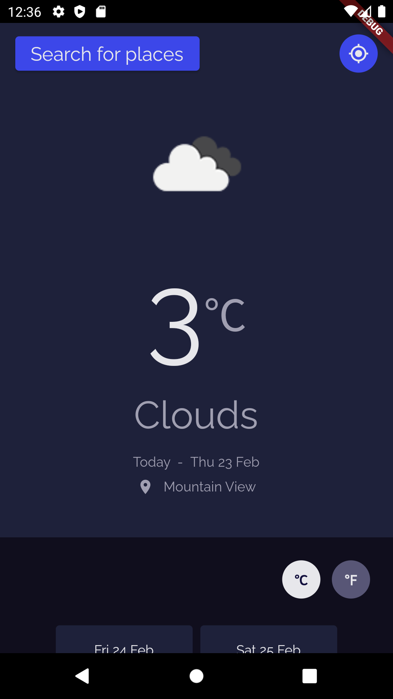
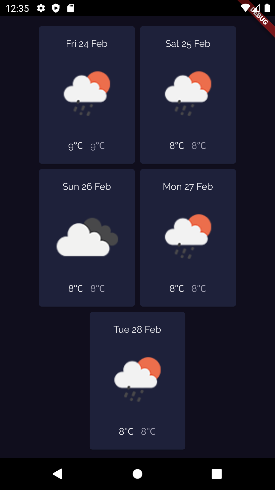
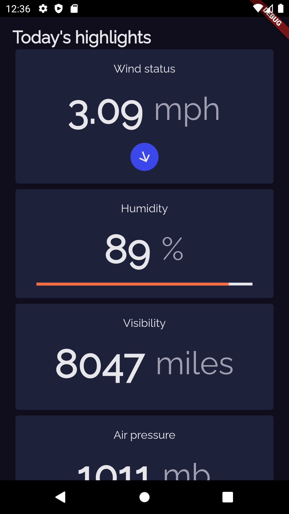
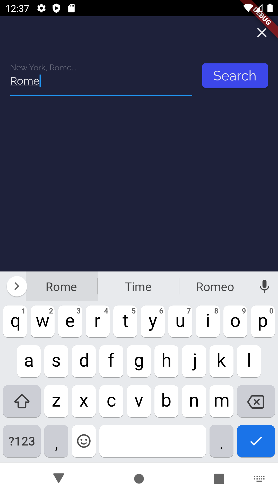
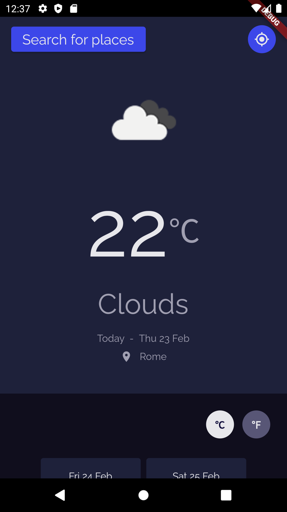

# Weather App

A weather app created with Flutter

## Getting Started

This project was made with [Flutter](https://flutter.dev/), retrieving data from the [Open Weather API](https://openweathermap.org/api). With this app, you can check the weather and forecast based on your location or search for a specific city, and you can also change between Celsius and Fahrenheit.

## How to use

Once you enter the application, you'll find the expected weather for the day in your location:

If you scroll down, you can see the forecast for the next 5 days, with the general weather, maximum and minimum temperatures:

And at the bottom, you'll see the highlights of the current weather, such as wind speed and direction, humidity, pressure, and visibility:

At the top is the search button, where you can search for any city you want to:

#
#
This is the mobile app of this web page: [Weather Page](https://rodrigogzmn6-weather-page.netlify.app/). Which code can be found here: [Rodrigogzmn6](https://github.com/Rodrigogzmn6/weather_page)

You can check the code of this app in my repository: [Rodrigogzmn6](https://github.com/Rodrigogzmn6/weather_app). I would love your feedback, thank you.